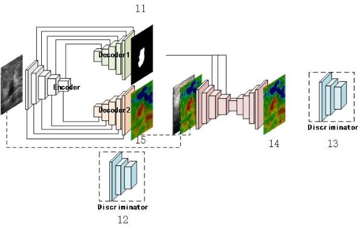
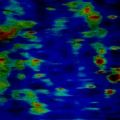

# GAN-for-2D-SWE-resconstruction

**a multi-task model which segments US image and reconstructs 2D-SWE images**

-------

+ **model structure**

+ **show some examples**

| Conventional US | Elastography | Resconstruction Ela |
|:----------------|:------------:|:-------------------:|
| |  |  |
